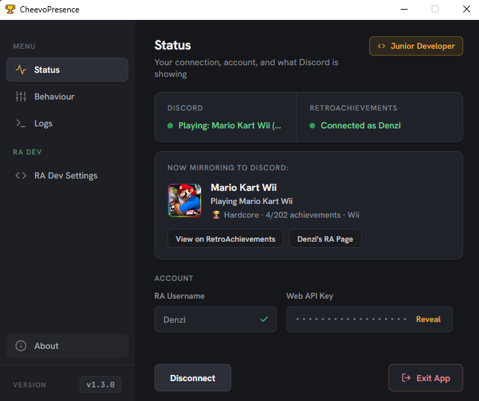

# CheevoPresence

**Mirror your RetroAchievements Activity to Discord**

 

CheevoPresence is a desktop app for Windows, macOS, and Linux that mirrors your RetroAchievements activity to Discord Rich Presence.

It watches your current RetroAchievements session, detects whether you are actively playing, and updates Discord with your game, platform, achievement progress, and quick links to your RetroAchievements profile, created sets, or game page.

  

---

## What It Does

- Shows your current RetroAchievements session as a live Discord Rich Presence with the actual game you are playing
- Shows a live in-app preview of what is currently being mirrored to Discord
- Detects when you are no longer actively playing and clears the Discord presence
- Supports profile and game-page buttons in Discord
- Detects RetroAchievements developer and staff roles, with optional developer activity titles
- Runs quietly in the background

This app was made with the intent to be as easy and lightweight as possible. You start the app, put in your RetroAchievements username and Web API key, click `Connect`, and it works. Close the settings window and CheevoPresence keeps running in the tray/menu bar.

  
  &nbsp;&nbsp;
  

---

## Getting Started

To use CheevoPresence, you need:

- A [RetroAchievements](https://retroachievements.org/) account
- Your RetroAchievements Web API key
- Discord installed and running on the same PC

### First-Time Setup

1. Launch CheevoPresence
2. Enter your RetroAchievement username
3. Enter your Web API key
4. Choose your preferred behavior settings
5. Click `Connect`

If everything is set up correctly, CheevoPresence will begin updating your Discord Rich Presence automatically.

The settings window also shows your current Discord/RetroAchievements status, a live preview of the presence being sent to Discord, logs, diagnostics, and update notices.

RetroAchievements developer options unlock automatically for accounts with a detected developer-capable role. They can show developer activity titles and optionally link to your created sets while developing achievements.

> [!IMPORTANT]
> Make sure to close the Settings Window normally, pressing the "Exit App" Button will end the process entirely.

### Tray/Menu-Bar Status

#### Windows / Linux

CheevoPresence uses different tray icons to show its current state:

| Icon | Tray icon state | Meaning |
| :---: | :--- | :--- |
|  | Default app icon | Starting up or connecting |
|  | Green icon | Connected and actively updating Discord |
|  | Gray icon | Idle, stopped, not playing, or not currently active |
|  | Red icon | Something needs attention, such as Discord not being open, a network issue, or an API/config problem |

#### macOS

CheevoPresence uses a monochrome menu-bar icon that stays template-styled to match the system UI.

| Preview | Menu-bar state | Meaning |
| :---: | :--- | :--- |
|  | Active | Connected and actively updating Discord |
|  | Inactive | Idle, stopped, not playing, or not currently active |
|  | Error | Something needs attention, such as Discord not being open, a network issue, or an API/config problem |

---

## Configuration and Privacy

CheevoPresence does not expect you to keep secrets inside the repository.

- The repository-level `config.json` is ignored by Git
- Runtime configuration is stored under `%APPDATA%\CheevoPresence\config.json` on Windows
- Runtime configuration is stored under `~/Library/Application Support/CheevoPresence/config.json` on macOS
- Runtime configuration is stored under `${XDG_CONFIG_HOME:-~/.config}/CheevoPresence/config.json` on Linux
- The API key is stored in a protected form on Windows, in the macOS Keychain on macOS, and in the Linux local config encoding on Linux rather than being written back as plain text in the repo
- `config.example.json` exists only as a clean template

### Diagnostic Logs

CheevoPresence writes local diagnostic logs so problems can be diagnosed without exposing anything in the app UI.

- Windows logs: `%APPDATA%\CheevoPresence\logs`
- macOS logs: `~/Library/Application Support/CheevoPresence/logs`
- Linux logs: `${XDG_STATE_HOME:-~/.local/state}/CheevoPresence/logs`

> [!NOTE]
> If something is not working, zip that folder and send it to me via Discord or post it in the Issue. It contains no API Keys or full Paths :)

---

## Building the App Yourself

If you want to modify or package CheevoPresence yourself, use the platform-specific build guides:

- Windows: [`.github/buildWindows.md`](./.github/buildWindows.md)
- macOS: [`.github/buildMacOS.md`](./.github/buildMacOS.md)
- Linux: [`.github/buildLinux.md`](./.github/buildLinux.md)

---

## Support the Project

If CheevoPresence made your setup a little nicer and you feel like supporting the project, a small tip on [Ko-fi](https://ko-fi.com/denzi) would be genuinely appreciated.

  

Thanks for checking out CheevoPresence.

